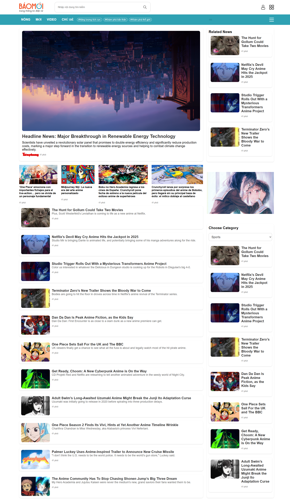
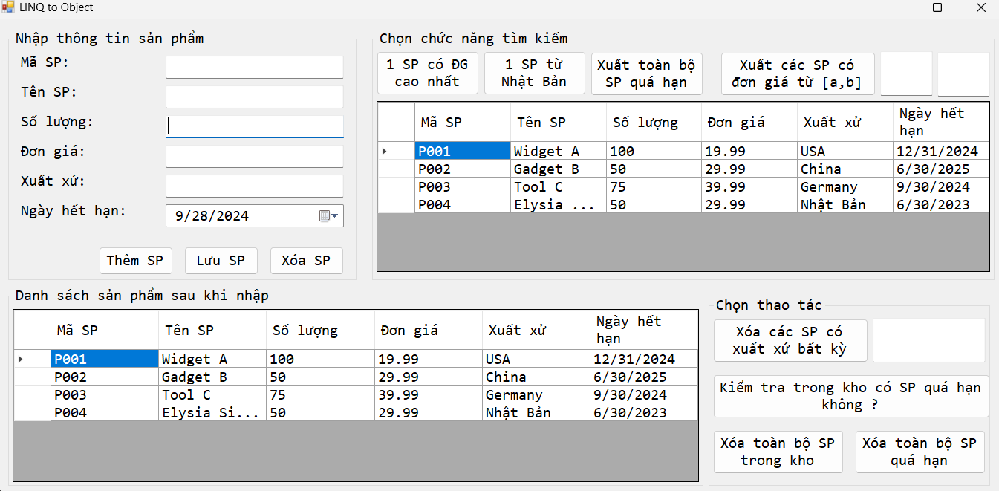

# .NET-Exercise

# NewsUI

# Product Management

# Set up and run
1. Clone the repository

2. Create a new database in SQL Server Management Studio

3. Run the script in the project directory to create the tables

4. Open the project in Visual Studio

5. Update the ADO.Net Entity Data Model in the project to connect to the database

6. Update the connection string in the App.config file

7. Run the project
